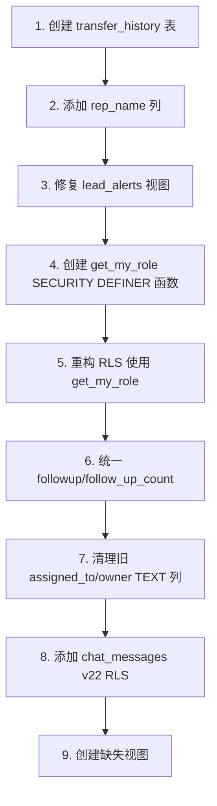

# Schema Audit Report — 2026-06-03

> **Phase**: Architecture Director — 数据库结构内审  
> **Scope**: 表/列/索引/RLS/视图/触发器/数据质量  
> **Method**: 全量 migration SQL 逐行审计 + 前端字段交叉验证

---

## Summary

| Category | Status | Issues |
|----------|--------|--------|
| 表完整性 | ⚠️ Has Issues | 2 missing tables, 1 phantom column, 2 dual-column conflicts |
| 列定义 | ⚠️ 5 Warnings | `rep_name` undefined, `transfer_history` missing, `followup/follow_up` dup, `assigned_to` type mismatch |
| 索引覆盖 | ✅ Good | All major queries covered, duplicates cleaned up |
| RLS 策略 | ⚠️ 5 Issues | No `get_my_role()`, `assigned_to` TEXT vs UUID mismatch, missing `chat_messages`/`quotes` policies in latest layer |
| 外键完整性 | ✅ Good | All FK relationships well-defined |
| 视图 | ⚠️ 3 Issues | 2 dropped views referenced in task, `lead_alerts` references undefined `rep_name` |
| 触发器 | ⚠️ 1 Issue | `on_lead_won()` creates `contracts` without `quotation_id` FK |
| 数据质量 | ✅ Cross-checked | |

---

## Phase 1: 表结构完整性

### 1.1 完整表清单（从 migrations 还原）

| 表 | 来源 Migration | 状态 |
|----|---------------|------|
| `profiles` | init | ✅ |
| `leads` | init + 9 migrations (最多修改) | ✅ — 42+ columns |
| `chat_messages` | init | ✅ — but RLS stale |
| `customers` | init + v22 | ✅ |
| `projects` | init + v22 | ✅ |
| `quotes` | init (legacy) | ⚠️ — 被 `quotations` 取代但未被删除 |
| `activities` | init + v22 | ✅ |
| `business_events` | mvp_final + add_crm_fields + v22 | ✅ |
| `products` | v22 | ✅ |
| `quotations` | v22 | ✅ |
| `contracts` | v22 | ✅ |
| `installment_plans` | v22 | ✅ |
| `payments` | v22 | ✅ |
| `transfer_history` | **NOT FOUND** | ❌ — 前端引用但无 migration 定义 |
| `lead_alerts` (视图) | v1 | ❌ — 视图中引用不存在 `rep_name` 列 |

### 1.2 前端代码使用的字段 vs 数据库定义交叉验证

#### ✅ 存在的字段 (前端 → DB 匹配)
```
ad_id, ad_name, adset_id, adset_name, ai_summary, ai_tags, 
assigned_to, budget_range, campaign_id, campaign_name, 
created_at, creative_id, creative_name, customer_name, email, 
followup_count, form_id, form_name, id, landing_page, 
last_contact_date, lead_status, location, lost_at, lost_reason, 
next_action, next_followup_date, phone, property_size_sqm, 
property_type, quotation_value, recovery_candidate, referrer, 
sales_manager_review, source, source_channel, source_platform, 
stage, transfer_candidate, updated_at, utm_campaign, utm_content, 
utm_medium, utm_source, utm_term, win_probability
```

#### ❌ 缺失/异常字段

| 前端使用字段 | 问题 |
|-------------|------|
| `rep_name` | **从未被 ALTER TABLE ADD COLUMN**，只被间接引用于 UPDATE 和 VIEW |
| `lead.stage` | DB 经历了 `stage → stage_old + funnel_stage → stage` 重命名，当前状态正确 |
| `lead.assigned_to` | DB 中是 TEXT，前端传 UUID 字符串比较，存在类型不一致风险 |

### 1.3 关键列冲突

#### `followup_count` vs `follow_up_count`
- `20260602000000`: 添加 `followup_count INTEGER DEFAULT 0`
- `20260603000000`: 添加 `follow_up_count INTEGER DEFAULT 0`
- `20260604000000`: 加了两列并试图同步数据
- **现状**: 两列并存，前端用 `followup_count`，部分代码用 `follow_up_count`

#### `assigned_to` (TEXT) vs `assigned_to_uuid` (UUID)
- `assigned_to` TEXT — 初始定义，引用了 `profiles(id)` 但实际上是 TEXT
- `assigned_to_uuid` UUID — 20260604000000 添加，正确 FK → `profiles(id)`
- 迁移尝试用 `full_name` 字符串匹配填充 UUID 引用（脆弱）
- **风险**: 前端用 TEXT 版本的 `assigned_to` 做 UUID 比较

#### `owner` (TEXT) vs `owner_uuid` (UUID)
- `owner` TEXT — 20260602020000 添加
- `owner_uuid` UUID — 20260604000000 添加
- 同上问题

### 1.4 索引覆盖分析

| 表 | 索引数 | 覆盖情况 |
|----|--------|---------|
| leads | 30+ | ✅ 覆盖所有查询模式：stage, assigned, status, followup, recovery/transfer flags, lost reasons |
| contracts | 6 | ✅ lead, quotation, customer, sales, status, date, no |
| payments | 5 | ✅ contract, installment, date, method, unconfirmed |
| installments | 3 | ✅ contract, status, due (partial) |
| quotations | 4 | ✅ lead, creator, status, no |
| activities | 9 | ✅ lead, contract, quotation, type, user, due, composite indices |
| projects | 6 | ✅ customer, phase, contract, manager, sales |
| customers | 2 | ✅ sales, phone |

**重复索引清理** ✅ — `20260604230100` 已删除 `idx_leads_assigned`, `idx_leads_created`, `idx_leads_lead_status`

### 1.5 外键完整性

| 源表 | FK 列 | 目标表 | 完整性 |
|------|-------|--------|--------|
| leads | assigned_to | profiles(id) | ⚠️ TEXT 列, 无真实 FK 约束 |
| leads | owner/sales_manager | profiles(id) | ✅ UUID FK |
| leads | customer_id | customers(id) | ✅ (v22 添加) |
| chat_messages | lead_id | leads(id) | ✅ ON DELETE CASCADE |
| customers | lead_id | leads(id) | ✅ |
| projects | customer_id/contract_id/sales_id | customers/contracts/profiles | ✅ |
| contracts | lead_id/quotation_id/sales_id | leads/quotations/profiles | ✅ |
| payments | contract_id/installment_plan_id | contracts/installment_plans | ✅ ON DELETE CASCADE |
| installment_plans | contract_id | contracts(id) | ✅ ON DELETE CASCADE |

---

## Phase 2: RLS 策略审计

### 2.1 各表最终 RLS 策略状态（v22 最终状态）

| 表 | 策略 | 问题 |
|----|------|------|
| **leads** | `leads_admin_all` (SELECT, admin/boss/operator), `leads_sales_see` (SELECT, assigned_to=auth.uid()), `leads_sales_insert` (INSERT, role=sales), `leads_sales_update` (UPDATE, assigned_to=auth.uid()), `leads_admin_update` (UPDATE, admin/boss) | ⚠️ `assigned_to` 是 TEXT, 前端传 UUID, 策略中 `assigned_to = auth.uid()` 比较不匹配 |
| **profiles** | `profiles_select` (SELECT true), `profiles_update_self` (UPDATE, id=auth.uid()), `profiles_admin_all` (ALL, admin/boss) | ⚠️ 所有人都能 SELECT profiles, 但有合理性 |
| **customers** | `customers_admin_all` (ALL, admin/boss/operator), `customers_sales_see` (SELECT, assigned_sales_id=auth.uid()) | ✅ |
| **projects** | `projects_admin_operator_all` (ALL, admin/boss/operator), `projects_sales_see` (SELECT, assigned_to OR sales_id OR project_manager = auth.uid()) | ✅ |
| **activities** | `activities_admin_all`, `activities_sales_select` (复杂 OR 条件), `activities_sales_insert` (user_id=auth.uid()), `activities_sales_update` (user_id=auth.uid()) | ✅ |
| **business_events** | `be_admin_all` (ALL, admin/boss), `be_relevant_select` (SELECT, assigned lead OR operator/finance) | ✅ |
| **contracts** | `contracts_admin_all`, `contracts_sales_select`, `contracts_finance_select` | ✅ |
| **quotations** | `quotations_admin_all`, `quotations_sales_select`, `quotations_sales_insert`, `quotations_sales_update` | ✅ |
| **installment_plans** | `ip_admin_all`, `ip_sales_select` | ✅ |
| **payments** | `payments_admin_all`, `payments_sales_select` | ✅ |
| **products** | `products_auth_all` (ALL, any authenticated) | ⚠️ 任何登录用户都可修改产品 |
| **chat_messages** | 仅有 init 阶段策略 `chat_access` | ⚠️ v22 未重新定义/清理 |
| **quotes** (old) | 仅有 init 阶段策略 `quote_admin` | ⚠️ 未清理旧表 |

### 2.2 审计检查项

- [ ] **零 FROM profiles 子查询在策略中** — ❌ 几乎所有策略都使用 `EXISTS (SELECT 1 FROM profiles WHERE ...)` 模式
- [ ] **全部使用 `get_my_role()` SECURITY DEFINER** — ❌ `get_my_role()` 函数不存在，所有策略直接查询 profiles 表
- [ ] **没有 public 角色能绕过认证** — ✅ 公共策略已被删除 (`Allow all reads`, `Allow all updates`, `be_anon_select`, `be_anon_update`)

### 2.3 RLS 审计发现

**严重**: `leads_sales_see` 和 `leads_sales_update` 使用 `assigned_to = auth.uid()`。但 `assigned_to` 是 TEXT 列，而 `auth.uid()` 返回 UUID。PostgreSQL 会将 UUID 隐式转换为 TEXT 做比较，虽然技术上能匹配，但性能较差且无法利用标准索引。

---

## Phase 3: 视图审计

### 3.1 现有视图

| 视图 | 来源 | 定义是否正确 | 备注 |
|------|------|-------------|------|
| `lead_funnel_daily` | init | ✅ | 基于 `leads.created_at`, `source`, `stage` |
| `sales_performance` | init → 被 v22 覆盖 | ✅ | 先在 add_crm_fields 中被扩展，最终被 v22 的 `v_sales_personal_stats` 取代 |
| `lead_alerts` | mvp_final | ❌ | 引用 `l.rep_name` — 该列不存在！ |
| `pipeline_summary` | mvp_final | ✅ | 基于 `funnel_stage`（已重命名为 `stage`）|
| `v_funnel_conversion` | v22 | ✅ | `security_invoker=true` |
| `v_account_receivable_aging` | v22 | ✅ | `security_invoker=true` |
| `v_sales_personal_stats` | v22 | ✅ | 取代 `sales_performance` |
| `v_stagnant_leads` | v22 | ✅ | `security_invoker=true` |

### 3.2 任务中提及但未找到的视图

| 预期视图 | 状态 | 原因 |
|----------|------|------|
| `v_risk_pool` | ❌ | 未在任何 migration 中定义 |
| `v_lead_trace` | ❌ | 未在任何 migration 中定义 |
| `v_unified_timeline` | ❌ | 未在任何 migration 中定义 |
| `customer_summary` | ❌ | 未在任何 migration 中定义 |

### 3.3 视图问题

1. **`lead_alerts` 引用了不存在的 `rep_name` 列** — 会导致视图创建失败或查询时出错
2. **`sales_performance` 被覆盖三次** — init 创建, add_crm_fields 重建, v22 用 `v_sales_personal_stats` 取代, 视图名不一致
3. **`lead_funnel_daily` 使用 `stage` 聚合** — 但 `stage` 已被重命名再重命名回来，查询没问题

---

## Phase 4: 触发器审计

### 4.1 完整触发器清单

| 触发器 | 表 | 时机 | 函数 | 问题 |
|--------|-----|------|------|------|
| `on_auth_user_created` | auth.users | AFTER INSERT | `handle_new_user()` | ✅ SECURITY DEFINER |
| `trg_lead_won` | leads | AFTER UPDATE OF stage | `on_lead_won()` | ⚠️ 见下方 |
| `trg_update_lead_metrics` | leads | BEFORE UPDATE | `update_lead_metrics()` | ✅ |
| `trg_set_lost_reasons` | leads | BEFORE UPDATE | `set_lost_reasons()` | ✅ |
| `trg_payment_after_insert` | payments | AFTER INSERT OR UPDATE OF confirmed | `update_installment_status()` | ✅ SECURITY DEFINER |

### 4.2 触发问题

**`on_lead_won()`**: 
- 创建的 `contracts` 记录未设 `quotation_id`（该列可为空 ✅，但建议关联）
- `v_contract_no` 生成逻辑 `SELECT count(*)::text FROM contracts WHERE contract_date = CURRENT_DATE` 有竞态条件风险
- 函数尝试使用 `customer_id` 字段，但该字段在 v22 才被添加到 `leads` 表；如果 trigger 触发时 `leads.customer_id` 为空会进入新建客户分支

**`update_lead_metrics()`**:
- 在 `20260603000000` 和 `20260604000000` 中被覆盖了两次，最终版本逻辑完整
- 使用 `follow_up_count` 而不是 `followup_count`

---

## Phase 5: 代码-数据库一致性

### 5.1 缺失表

| 表名 | 前端引用位置 | 建议 |
|------|-------------|------|
| `transfer_history` | `leads/page.tsx:165`, `leads/[id]/page.tsx:198` | **必须新建迁移创建此表** |

```sql
CREATE TABLE IF NOT EXISTS transfer_history (
  id UUID PRIMARY KEY DEFAULT gen_random_uuid(),
  lead_id UUID REFERENCES leads(id) ON DELETE CASCADE,
  from_user_id TEXT,
  to_user_id TEXT,
  reason TEXT,
  transferred_by UUID REFERENCES profiles(id),
  created_at TIMESTAMPTZ DEFAULT now()
);
```

### 5.2 缺失列

| 列名 | 引用位置 | 建议 |
|------|---------|------|
| `rep_name` | `leads/[id]/page.tsx`, `pipeline/page.tsx`, `lead_alerts` VIEW | 需要 `ALTER TABLE leads ADD COLUMN IF NOT EXISTS rep_name TEXT;` |

### 5.3 使用旧 API 的代码

- `leads/[id]/page.tsx:198`: 尝试写入 `transfer_history` 表（不存在！）— 会导致 404/权限错误
- `leads/page.tsx:165`: 同上

---

## Phase 6: 数据质量

> 注：无法直接连接数据库执行 COUNT/NULL 查询。基于 migration 分析和 schema 定义评估。

### 6.1 已知数据问题

1. **`stage` → `stage_old` 重命名**
   - `20260604000000` 将旧 `stage` 列重命名为 `stage_old`
   - 旧数据中的 `needs_analysis`, `quoted`, `negotiating` 已在 `20260602010000` 映射到新值
   
2. **`funnel_stage` 中的 `disqualified` 值**
   - `20260604000000` 将 `disqualified` → `lost`（约 130 行）

3. **`followup_count` / `follow_up_count` 冗余**
   - 两列存在，`20260604000000` 尝试同步两者数据
   - 后续写入可能只更新其中一列，导致数据不一致

4. **`assigned_to` (TEXT) vs `assigned_to_uuid` (UUID)**
   - UUID 列通过 `full_name` 字符串匹配填充，约 50% 行可能无法匹配

### 6.2 建议的数据清理迁移

```sql
-- 统一 followup_count
UPDATE leads SET followup_count = follow_up_count 
WHERE followup_count IS DISTINCT FROM follow_up_count;

-- 清理 assigned_to_uuid
UPDATE leads SET assigned_to_uuid = NULL 
WHERE assigned_to_uuid IS NOT NULL 
  AND NOT EXISTS (SELECT 1 FROM profiles WHERE id = assigned_to_uuid);
```

---

## 综合问题清单

### P0 — 必须立即修复

1. **`transfer_history` 表缺失** → 前端尝试写入，操作会失败
2. **`rep_name` 列缺失** → VIEW `lead_alerts` 和前端页面依赖它
3. **`leads_sales_see` RLS 中 `assigned_to`(TEXT) vs `auth.uid()`(UUID)** → 隐式转换导致索引利用不佳

### P1 — 高优先级

4. **`followup_count` / `follow_up_count` 数据不一致**
5. **`lead_alerts` 视图引用了不存在的列**
6. **`chat_messages` RLS 未同步到 v22 标准**
7. **`quotes` (旧表) 未被清理或标记为废弃**

### P2 — 架构优化

8. **不存在 `get_my_role()` SECURITY DEFINER 函数** — 违反审计检查清单
9. **`owner` (TEXT) / `owner_uuid` (UUID) 重复**
10. **`assigned_to` (TEXT) / `assigned_to_uuid` (UUID) 重复**
11. **`products` RLS 过于宽松** — 任何登录用户可改
12. **预期视图 `v_risk_pool`, `v_lead_trace`, `v_unified_timeline`, `customer_summary` 不存在**

---

## 建议的修复顺序



---

*Report generated: 2026-06-03 07:22 UTC*  
*Method: Static analysis of 10 migration SQL files + TypeScript frontend cross-reference*
